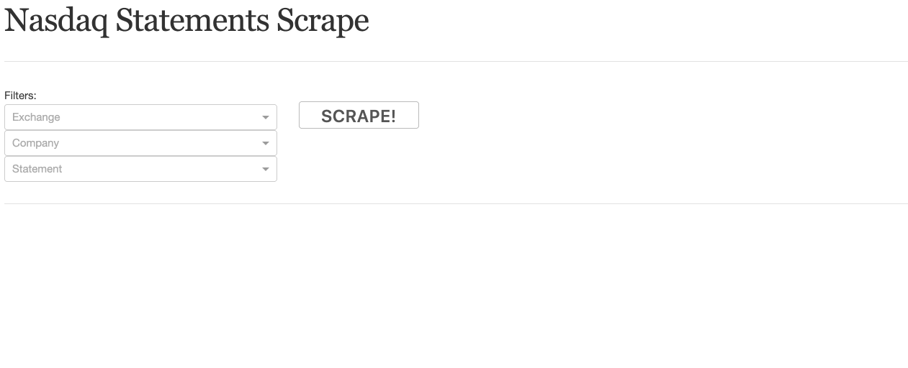
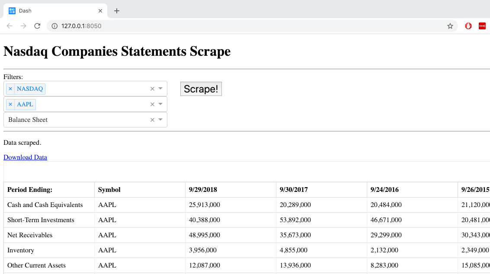

<h1><strong>Nasdaq Companies Statements Scrape</strong></h1>

This is a demo of the Dash Plotly Python framework applied on web scrape, especifically on Nasdaq Website Companies Statements.

It's recommended to use Python 3.7. All the requirements are specified on requirements.txt.

Functionalities:

<ul>
<li>Scrape Companies statements on Nasdaq website;</li>
<li>Dash Plotly Python framework to visualize and download the data.</li>
</ul>
 

Main Page:

Export Data:

